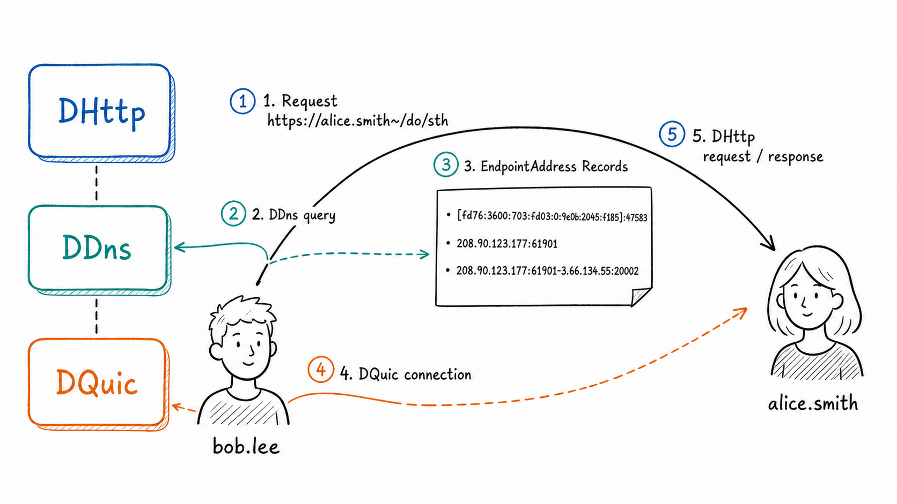

<p align="center">
  <a href="https://www.dhttp.net" title="DHttp home">
    
  </a>
</p>
<h3 align="center">Clients can be servers; all endpoints are created equal.</h3>

[](https://crates.io/crates/dhttp)
[](https://www.apache.org/licenses/LICENSE-2.0)
[](https://docs.dhttp.net/en/docs/protocol/dhttp)
[](https://www.rust-lang.org/)

HTTP has been the Internet's most widely used protocol for decades, powering the Web and reaching into nearly every corner of the digital world. Yet beneath that prosperity lies a deep structural flaw: HTTP created a hierarchy between clients and servers. Servers became the aristocracy—named, served by DNS, discoverable, and globally callable. Clients remained nameless subjects, continuously sending their data upward for servers to analyze and monetize. This architectural inequality has become the machinery that entrenches **technological feudalism** and perpetuates **data colonialism**.

DHttp is **Decentralized HTTP on QUIC and HTTP/3**. It extends HTTP: each endpoint is both a client and a server, and domain names extend beyond servers to every endpoint. **A name for every endpoint** seems so basic that we overlook its profound significance: it is the foundation of **Omniconnectivity**, enabling identification, discovery, invocation, authorization, and authentication—all through a simple name. **This is DHttp**—opening a new era of Omniconnectivity for the Internet of Agents.

## DHttp vs HTTP

| "Interconnected"? | HTTP | DHttp |
| --- | :---: | :---: |
| Client to server | ✓ | ✓ |
| Server to server | ✓ | ✓ |
| Client to client | ✗ | ✓ |
| Server to client | ✗ | ✓ |


> In HTTP, network listening is confined to the server side: servers can accept incoming connections, whereas clients lack this capability. Thus, HTTP provides only partial connectivity, leaving interconnection across the World Wide Web dependent on cloud-hosted infrastructure. DHttp, conversely, establishes client-server equivalence, treats all endpoints with endpoint equality, and achieves **Omniconnectivity** without depending on privileged endpoints such as traditional servers.

## How DHttp Extends HTTP

- **Client and Server in One** — Every client can also listen for incoming connections, and serve HTTP APIs. Each endpoint is both client and server; all endpoints are created equal.
- **Names extend to Clients** — DHttp makes domain names and PKI certificates available to every endpoint, not just servers. Every endpoint deserves a name.
- **EndpointAddress Record** — Every endpoint's network address can be resolved by name, including in private networks; the result is a set of EndpointAddress Records, not just an IP address.
- **Peer-to-Peer Communication** — Using DQuic to traverse NATs, striving to establish a direct peer-to-peer path—including across IPv4 and IPv6 networks—for every connection.
- **Volunteer Relay Network** — Any qualifying endpoint can voluntarily provide relay service for endpoints in private networks.

## DHttp Request Flow

<p align="center">
  
</p>

> Bob.Lee makes an DHttp request to Alice.Smith. DDns resolves `alice.smith` to the EndpointAddress record, DQuic establishes the connection, and DHttp carries the request and response.
> Alice.Smith's endpoint resides on a private network and would otherwise be unreachable. With assistance from `3.66.134.55:20002`, it discovers its public address, `208.90.123.177:61901`, establishes a listener, and traverses NAT to form a direct peer-to-peer connection.

## Quick start

### Rust SDK

Add the published crate to your Cargo manifest:

```toml
[dependencies]
dhttp = "0.6.0-beta.5"
```

### Client Mode

```rust,no_run
use dhttp::endpoint::Endpoint;

#[tokio::main]
async fn main() -> Result<(), Box<dyn std::error::Error>> {
    // Loads credentials from the DHttp home directory for this name.
    let endpoint = Endpoint::load("alice.smith~").await?;

    let mut response = endpoint
        .get("https://bob.lee~/welcome")
        .response()
        .await?;

    println!("{}", response.read_to_string().await?);
    Ok(())
}
```

### Server Mode

```rust,no_run
use dhttp::endpoint::{server::Service, Endpoint};

#[tokio::main]
async fn main() -> Result<(), Box<dyn std::error::Error>> {
    let endpoint = Endpoint::load("bob.lee~").await?;

    let service = Service::new().get("/welcome", |_request, response| async move {
        response.set_body("hello from DHttp");
    });

    endpoint.listen(service).await?;
    Ok(())
}
```

## Node.js and Python SDK

The native bindings mirror the Rust endpoint model while following each ecosystem's conventions.

Node.js:

```js
import { Endpoint } from "@genmeta/dhttp";

const endpoint = await Endpoint.create();
const response = await endpoint.fetch("https://alice.smith~/welcome");
console.log(await response.text());
```

Python:

```python
import dhttpy

endpoint = await dhttpy.Endpoint.create()

async with endpoint.get("https://alice.smith~/welcome") as response:
    print(await response.text())
```

See [DHttp SDKs](https://docs.dhttp.net/docs/core-components/sdk) for more information.
