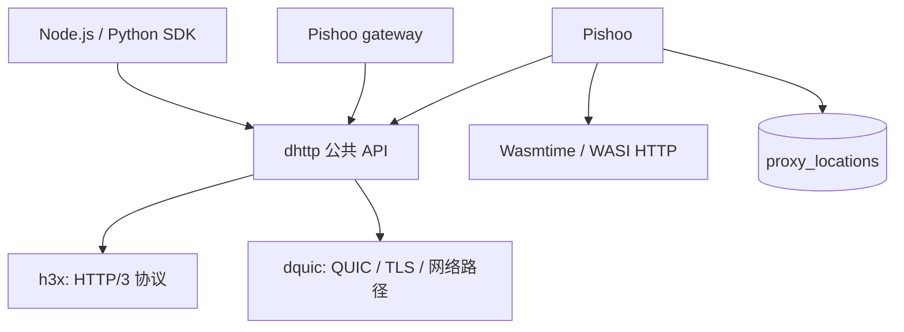
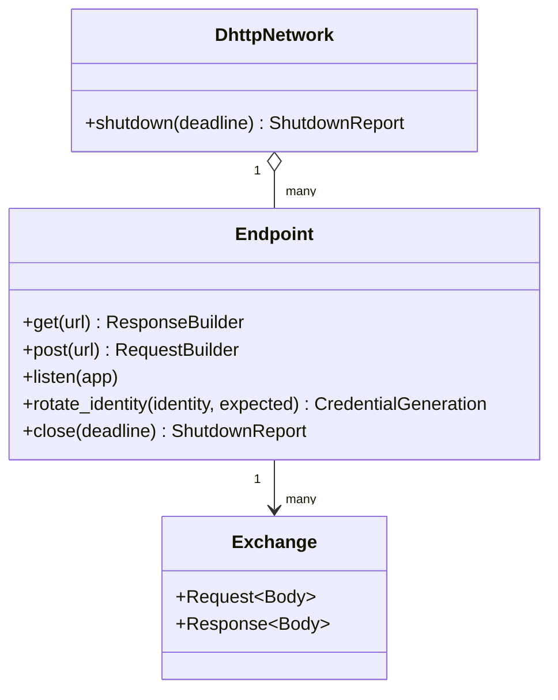
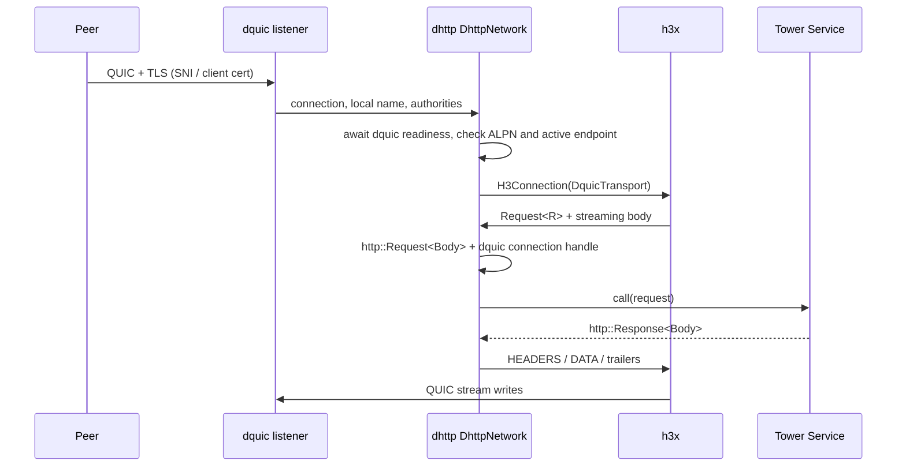
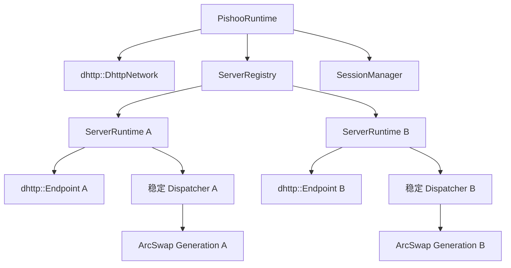

# dhttp 下一版职责与架构设计

> 历史设计：本轮 h3x/dhttp/Pishoo 对接及结构成员以 [三仓接口冻结 v1](../../../pishoo/design/README.md) 和 [dhttp 结构清单](../../../pishoo/design/dhttp-interfaces.md) 为准。本文保留历史讨论，不作为本轮实现依据。

状态：**设计提案，尚未实现。**

日期：2026-09-22。

本文保留早期分析基线；Rust 公共接口以 [顶层接口审查稿](../api/top-level-review.md) 为准。WASM 接入按本轮职责调整：Pishoo 负责执行、OpenAPI 与身份沙盒，DHTTP 只接收标准 Router/Service。详细边界见 [Pishoo 服务接入](../api/pishoo-service-boundary.md)。

本文分析当前 `dhttp` 的职责，并以本地 `h3x feat/wasm`、`dquic dev` 和 Pishoo design 文件为输入，定义下一版 dhttp 的边界、核心 API、SDK 形状及下一版 Pishoo 的接入方式。

用户输入中的 `h3x feat/awsm` 在本地不存在；本文按实际存在的 `feat/wasm` 分支处理。

## 1. 结论

下一版 dhttp 应成为 **带有身份的 HTTP/3 通信库**：向下组合 h3x 与 dquic，向上只暴露稳定的 DHTTP 端点、HTTP 消息、连接身份、服务登记和生命周期接口。

核心依赖方向固定为：



各层的关键职责如下：

| 层 | 负责 |
| --- | --- |
| dquic | QUIC 连接、TLS 握手、双向/单向流、datagram、网络接口、路径与 NAT 穿透 |
| h3x | HTTP/3 SETTINGS、QPACK、HEADERS/DATA/trailers、GOAWAY、请求流状态与协议错误 |
| dhttp | DHTTP 名称和身份、DNS、共享网络资源、dquic→h3x 适配、连接复用、服务登记、已验证连接身份、标准 HTTP Body、取消与关闭、SDK 语义 |
| Pishoo | Server 目录、SQLite 代理路由、静态文件、WASM/WASI HTTP 运行、OpenAPI、身份沙盒、应用授权、发布版本和终端业务策略 |

Pishoo、gateway 和 SDK 不再直接使用 `h3x::*`、`dquic::*`、`qconnection::*` 或 QUIC stream 类型。dhttp 内部允许替换 dquic 的连接实现，调用方 API 不随之变化。

## 2. 本地分析基线

本文只读分析了相邻仓库，没有切换或修改它们的分支。

| 仓库 | 本地基线 | 工作区状态 | 与设计有关的事实 |
| --- | --- | --- | --- |
| dhttp | `main@68744e0`，`v0.6.2` | 干净 | 依赖 `h3x 0.6.1`、`dquic 0.7.1`，仍使用旧 `H3Endpoint`/`QuicEndpoint` 组合 |
| h3x | `feat/wasm@1bd1a8e` | 6 个未提交文件 | crate 版本 `0.6.2`；已移除旧 dquic feature 和 Endpoint/Runtime，只保留 HTTP/3 primitives、`Transport`、`H3Connection`、`Pool` |
| dquic | `dev@bc039623` | 干净 | crate 版本 `0.7.2`；公开 `dquic` crate 仍基于 `qconnection 0.8.2`，新 `qconn/qtransport` 尚未接入公开 facade |
| Pishoo | `main@fcd203c` | 本地分支分叉，design 文件未跟踪 | 下一版 design 已选择单进程、多 Server、固定目录、单表代理配置和进程内 WASM |

h3x 的未提交修改包含两个会影响关闭语义的修正：

1. 本地 GOAWAY 后同时停止 `open_bi` 和 `accept_bi`；
2. 在最终 HEADERS 前收到 EOF 时取消配对方向，防止交换残留。

这些修改属于本文要求的“最新本地状态”，但 Git 依赖无法锁定未提交内容。实施前必须先形成一个可引用 commit。

dquic dev 的 workspace MSRV 是 Rust 1.88，当前 dhttp README 标注 Rust 1.85+。下一版若采用该 dev 基线，需要把 dhttp、SDK 构建镜像和 Pishoo 的 Rust 基线统一到 1.88，或者先由 dquic 明确降低并验证 MSRV。

### 2.1 当前依赖不能直接升级

当前 dhttp 在 `dhttp/src/endpoint.rs` 中使用：

- `h3x::dquic::H3Endpoint`；
- `h3x::endpoint::H3Endpoint`；
- `h3x::connection::ConnectionBuilder`；
- dquic 旧 `QuicEndpoint` 及其 identity replacement API。

这些接口在本地 h3x `feat/wasm` 中已不存在。最新 h3x 的公开面是：

- `Transport` 和 `TransportError`；
- `H3Connection<T>`；
- `Request<R/W>`、`Response<R/W>`、`ArcWndBuf`；
- `ReadRequest`、`WriteRequest`、`ReadResponse`、`WriteResponse`；
- `Pool<K, T, E>`。

因此升级工作本质上是重新建立运行层和适配层，不能只修改 Cargo 版本。

### 2.2 依赖源还有一个隐含风险

h3x 直接依赖 `qbase 0.6.4` 和 `qrecovery 0.6.2`，其 `Transport` 约束直接引用 `qrecovery::StopSending/CancelStream`。dquic dev workspace 也包含同版本包，但 Git/path 源和 crates.io 源可能被 Cargo 视为不同包，导致 trait 类型不相同。

首个实现阶段必须二选一：

1. 让 h3x 定义自己的最小 receive/send cancellation trait，解除公开传输契约对 qrecovery 的类型耦合；这是推荐的长期方案。
2. 在集成阶段把 h3x 与 dquic 使用的 `qbase/qrecovery` 固定到同一 source 和 revision，并在发布前先发布一致版本。

Pishoo 只能依赖 dhttp，不能用自己的 `[patch]` 修复这条底层依赖图。

## 3. 当前 dhttp 的实际职责

当前仓库已经承担六类职责。

### 3.1 DHTTP 门面

根 crate 重导出 identity、home、access、log、h3x 和 dquic。它让应用通过一个 crate 获得完整协议栈，但也把底层库的模块布局变成了 dhttp 的公开契约。

### 3.2 Endpoint 装配

当前 `Endpoint` 同时装配：

- DHTTP identity；
- DNS resolver/publisher；
- STUN、mDNS 和共享 network；
- dquic 客户端/服务端配置；
- h3x endpoint 和连接 builder；
- 高层 GET/POST/listen；
- identity 热替换。

这个模型适合单应用单端点，但 Pishoo 需要一个进程共享网络设施并承载多个名称。

### 3.3 HTTP 消息和服务路由

`dhttp/src/message.rs`、`endpoint/client.rs` 和 `endpoint/server/*` 提供自有消息状态机、body 操作、方法路由与 service。它们与旧 h3x 消息 API 紧密耦合，并与最新 h3x 的 `Request/Response + ArcWndBuf` 发生重叠。

### 3.4 网络、发现和信任默认值

`network.rs`、`ddns.rs`、`bootstrap.rs` 和 `trust.rs` 管理 DHTTP 特有的发现、发布、bootstrap 与信任配置。这部分仍应由 dhttp 保留，因为它们表达的是 DHTTP 产品语义，而不是普通 QUIC 或 HTTP/3 语义。

### 3.5 Access、home 和 log 组件

这些 workspace crate 有独立价值，但当前核心 `dhttp` 对它们是硬依赖。下一版中：

- 不保留独立的 `dhttp-identity` crate；当前使用的 DHTTP 名称和证书规则归 dhttp-home，QUIC/TLS 身份材料由 dquic 提供；
- home 的本地凭据加载并入 `dhttp::home`，作为可选 feature，不再单独发布 crate；
- access/log 作为可选 middleware 和工具 crate；
- 核心 DhttpNetwork 不读取 access 数据库，也不决定 Pishoo 策略。

### 3.6 Node.js/Python SDK

`dhttp-api` 目前再次依赖 dhttp、ddns 和 h3x，并暴露 raw message reader/writer、connection 和 endpoint。这个方式把 Rust 内部类型变化扩散到了 N-API、PyO3、JS 包装和 Python 包装四层。

## 4. 当前模型的主要问题

| 问题 | 后果 | 下一版处理 |
| --- | --- | --- |
| 公开重导出 h3x/dquic | 上游重构直接破坏 Pishoo 和 SDK | 底层类型改为 private；只保留 dhttp 自有类型 |
| Endpoint 自带整套网络 | 多名称重复资源，关闭边界不清楚 | 引入可选共享的 `DhttpNetwork`，端点共享它 |
| h3x 与 dhttp 都有消息抽象 | body、取消和错误可能双重建模 | 客户端提供流式 builder，服务适配采用 `http/http-body`；协议状态归 h3x |
| SDK 直接包装 raw stream | 语言绑定被 Rust 内部 API 牵引 | SDK 绑定稳定的 Endpoint/Request/Response/Body |
| identity 替换跨多层 | 新旧证书、连接池、旧连接的行为不一致 | 引入 credential generation 和原子替换契约 |
| 连接池 owner 不唯一 | GOAWAY、终止、撤销和 idle 回收可能漏清理 | dhttp 制定复用策略，h3x Pool 保存唯一复用集合 |
| Drop 承担异步清理 | 任务可能失去 owner，测试和退出不可控 | 显式 stop/drain/shutdown；Drop 只发出同步撤销信号 |
| WebTransport 旧接口已删除 | 当前 Pishoo SSH 链路无法按原类型迁移 | 作为独立协议扩展交付，不伪装成普通 HTTP 已完成 |

## 5. 目标领域模型

领域术语同时记录在仓库根目录 `CONTEXT.md`。公共对象采用以下关系：



### 5.1 共享网络资源（DhttpNetwork）

`Endpoint` 是应用入口，不要求调用方先创建其他顶层对象。多身份应用可以显式注入同一个 `DhttpNetwork` 复用网络资源；普通应用由 Endpoint builder 创建并持有它。

`DhttpNetwork` 只表达共享网络资源及其关闭边界，不是容纳所有功能的通用 runtime。职责按具体模块分开：`discovery` 管理解析和发布；`connection` 管理连接池和连接任务；`listener` 管理多名称接入及服务登记；`transport` 适配 dquic 与 h3x。网络对象协调这些资源的关闭，不负责应用路由或身份文件加载。

注入隔离的网络资源后，同一进程可以创建多个网络用于测试。dquic 默认全局 router 只允许一个 listener 时，重复启动必须返回清晰的 `already_running` 错误。Pishoo 可让多个 Endpoint 共享一个网络；它与 Tokio runtime 无关。

### 5.2 Endpoint

`Endpoint` 是逻辑 DHTTP 参与方，包含规范化名称、可选 identity、credential generation、网络 profile 引用和 DhttpNetwork 引用。它可以发起请求；具有 identity 的 Endpoint 可以登记服务。

Endpoint 不是 QUIC 连接，也不独占 UDP socket。多个 Endpoint 可以共享同一 DhttpNetwork 和物理监听资源。

### 5.3 监听与停止接入

同一个 Endpoint 同时只运行一个 app。同一共享 listener 中，一个规范化名称只绑定一个活动 Endpoint。内部记录名称与 app 的对应关系即可，不公开 ServiceRegistration 类型。

`endpoint.listen(app).await` 持续处理请求，直到停止或错误退出。结束 `endpoint.listen(app)` future 撤销该 Endpoint 的监听登记；已接入请求可继续完成。`endpoint.close(deadline).await` 排空并关闭该 Endpoint 的请求、连接和后台任务，不影响其他 Endpoint。

普通应用内容更新在 Router 或稳定 dispatcher 内完成，不重建监听。listen future 结束时清理监听登记。

### 5.4 Exchange

一次 Exchange 覆盖请求头、请求体、响应头、响应体、trailers、stream 取消和实际网络输出完成。请求 handler 返回 `Response` 只表示应用产生了响应头，不能表示 Exchange 已结束。

## 6. 推荐的 Rust 公共 API

下面是目标接口，尚未实现。应用通过 Endpoint 发起带身份的 dquic HTTP/3 请求，或者把 Router 交给 Endpoint 接收请求。

```rust
let endpoint = Endpoint::load("alice.example").await?;

// GET 默认没有请求体，发完请求头即结束请求方向，等待响应头。
let mut response = endpoint.get(url)
    .header("accept", "application/json")
    .await?;
let body = response.read_to_bytes().await?;

// POST 默认打开流式请求体；首次 await 不等待响应头。
let (mut request, response) = endpoint.post(url)
    .header("content-type", "application/octet-stream")
    .await?;
request.write(chunk).await?;
request.shutdown().await?;
let mut response = response.await?;
let body = response.read_to_bytes().await?;

// app 是 Router；路由匹配和 handler 组合属于 app。
let app = Router::new().route("/upload", post(upload));
endpoint.listen(app).await?;
```

### 6.1 Builder 和流的语义

- `get(url)` 返回 `ResponseBuilder`；`.header(name, value)` 链式配置，`.await` 返回 `Result<Response>`。HEAD 等无请求体便捷调用具有相同语义。
- `post(url)` 返回 `RequestBuilder`；`.header(name, value)` 链式配置，`.await` 返回 `Result<(RequestWriter, PendingResponse)>`。PUT/PATCH 和显式流式请求沿用这个形状。
- 两类 builder 的返回类型静态确定，不因同一 builder 内的 method 值改变 await 输出类型。需要携带请求体的 GET 可使用显式 `endpoint.request(method, url)` 流式入口。
- `RequestBuilder` 的 await 完成解析、连接和请求头发送后立即返回。`PendingResponse` 是独立响应 future，其 await 等待响应头并返回 `Result<Response>`。不能在返回 writer 前等待响应头，否则读取完整上传后才响应的服务端会导致死锁。
- `RequestWriter::write` 是异步写入，受流量控制和有界缓冲背压约束；`shutdown` 发送剩余数据及 trailers，并结束请求方向，重复调用幂等。之后写入返回已关闭错误；它不关闭响应方向或 Endpoint。
- 收响应和继续写请求可并发进行；服务端可提前响应。丢弃未完成 writer 或响应句柄会按交换取消规则通知 driver，禁止留下无人管理的流。
- header/URI 校验错误通过 builder 的 await 返回。身份来自 Endpoint 配置和握手，不通过 header 注入。

### 6.2 服务端 Router

`endpoint.listen(app).await` 运行该身份的请求接入循环，返回 `Result<()>`；正常停止返回 Ok，接入失败返回错误。app 是 dhttp Router，按方法和路径组合 handler；Tower 适配接受标准 `http::Request<Body>` 并返回 `http::Response<Body>`。

listen 不返回额外服务登记对象。需要同时执行其他工作时，可以 spawn listen 或使用 select 并发运行。应用通过 Endpoint 停止监听或关闭，通过请求关联的 dquic 连接读取对端身份。原生 Request/Response 提供 connection 访问，Tower 适配在 extensions 放入同一连接句柄，不复制身份字段，也不创建 Context 对象。

### 6.3 模块和 crate 边界

```text
dhttp
  endpoint      Endpoint 构造、身份关联、get/post/request/listen
  client        请求 builder、RequestWriter、PendingResponse、Response
  server        入站请求与响应适配、监听生命周期
  router        方法/路径路由与 handler 组合
  identity      DHTTP 名称、证书校验、身份准备与更新
  home          可选本地凭据加载
  discovery     名称解析、DNS 发布与 bootstrap
  network       可共享的 DhttpNetwork 和网络配置
  connection    私有连接池与连接生命周期
  listener      私有多名称接入与准入控制
  transport     私有 dquic → h3x 适配
  body          标准 HTTP Body、背压与取消桥接
```

不建立 `runtime` 模块或 crate。`dhttp-api` 保留语言绑定职责；access/log 按独立复用价值保留为可选组件。独立的 `dhttp-identity` crate 已移除，当前使用的名称和证书规则归 dhttp-home；通用 TLS 能力由 dquic 提供，底层库不反向依赖 dhttp。

稳定公共面包括 Endpoint、Router、请求 builder、RequestWriter、PendingResponse、Response、Body、连接访问与错误码。`DhttpNetwork` 仅为需要共享资源的高级配置入口；`Endpoint::load` 和 builder 是默认构造方式。H3Connection、QPACK 和原始 stream 类型不属于顶层接口；dquic 连接通过明确的 connection 访问口提供握手身份，不另外包装认证结构。

## 7. dquic → h3x 内部适配

dhttp 新增私有适配器：

```text
DquicTransport
  Arc<dquic::qconnection::Connection>
  fixed h3x::Role
  DquicRecvStream(StreamReader)
  DquicSendStream(StreamWriter)
```

它实现 h3x `Transport`，映射关系如下：

| h3x 操作 | dquic dev 操作 |
| --- | --- |
| `open_bi` | `Connection::open_bi_stream` |
| `accept_bi` | `Connection::accept_bi_stream` |
| `open_uni` | `Connection::open_uni_stream` |
| `accept_uni` | `Connection::accept_uni_stream` |
| `close(reason, code)` | `Connection::close` |
| 终止观察 | `Connection::terminated` |
| 本地/远端身份 | `local_authority` / `remote_authority` |

适配器必须满足以下规则：

1. 创建 `H3Connection` 前等待 QUIC handshake 完成，并验证协商 ALPN 为 `h3x::ALPN`。
2. role 在构造时读取并固定，后续不把 `Connection::role()` 的失败伪装成另一 role。
3. stream RESET/STOP code 保留为 stream scope 错误；连接终止映射为 connection scope 错误。
4. accept/open future 被取消时，未交付 stream 仍由 dquic 拥有。
5. HTTP/3 协议码只由 h3x 解释；dhttp 不复制一套 frame 或 QPACK 状态机。
6. 连接终止必须唤醒 open/accept/body I/O 和 dhttp 的 drain waiter。

dquic dev 中的新 `qconn/qtransport` 仍处在 workspace 内部演进阶段，公开 dquic crate 当前继续依赖 `qconnection`。本轮适配只面向 dquic facade 和它公开的 qconnection re-export；后续 dquic 切到 qconn 时只替换本模块。

初版关闭 0-RTT。等重放语义、请求方法策略和身份上下文经过真实链路测试后再单独启用。

## 8. HTTP Body、背压和取消

### 8.1 公共 Body

dhttp 公共 Body 实现标准 `http_body::Body<Data = Bytes>`，帧类型保留 DATA 和 trailers。内部可使用 h3x `ArcWndBuf`，但调用方看不到窗口类型。

Body 只要求 `Send`，不额外要求 `Sync`，以适配 Axum、WASI HTTP 和语言 SDK 的异步流。所有桥接使用有界缓冲，不能把请求或响应先 `read_to_end`。

### 8.2 并行推进

client driver 同时推进：

- 请求头和请求体发送；
- 响应头接收；
- 响应 body 交付。

server driver 同时推进：

- 请求 body 接收；
- handler；
- 响应头和响应 body 发送。

因此服务端可以在未读完上传体时返回响应头，客户端也可以收到响应头后继续上传。这个行为是 Pishoo WASI 流式处理的前置条件。

### 8.3 取消矩阵

| 事件 | 请求接收方向 | 响应发送方向 | 连接 |
| --- | --- | --- | --- |
| handler 明确放弃未读请求体并正常响应 | STOP_SENDING `H3_NO_ERROR` | 继续 | 保留 |
| 客户端取消响应 body | 当前 response stream 停止 | 当前 request stream 按状态取消 | 保留 |
| 响应 headers 后 body 失败 | 不再发送第二组 headers | RESET 当前 stream | 保留，除非 h3x 判定连接级错误 |
| 服务登记停止准入 | 已接收交换继续 | 已接收交换继续 | 可继续服务其他登记 |
| DhttpNetwork deadline 到期 | 取消所有剩余交换 | 取消所有剩余交换 | dquic close |

Body 的 Drop 只发出取消信号；清理、reset/stop 和 join 在 DhttpNetwork 所有的任务域中完成。正常 EOF、应用替换 response body、HEAD/204/304 抑制 body 是不同事件，driver 必须按实际发送状态决定协议动作。

## 9. 身份和请求上下文

### 9.1 PreparedIdentity

identity 在交给 Endpoint 前完成：

- DHTTP 名称规范化；
- 证书链解析和信任约束；
- 私钥与证书匹配；
- DHTTP subject key identifier 校验；
- 名称覆盖校验。

`rotate_identity` 使用 compare-and-swap generation。新材料验证失败或 expected generation 不匹配时，旧 identity 保持可用。

### 9.2 dquic 缺失接口

dquic dev 的 `Server` 已用 `ArcSwap<CertifiedKey>`，公开接口只支持 `update_ocsp`，尚无完整证书链和私钥替换方法。需要在 dquic 增加原子 API：

```rust
pub fn replace_certified_key(
    &self,
    expected: IdentityGeneration,
    next: CertifiedKey,
) -> Result<IdentityGeneration, ReplaceIdentityError>;
```

校验在 swap 前完成。已有连接继续持有握手时使用的身份；新握手使用新 generation。出站连接池 key 包含本地 credential generation，替换后不再复用旧凭据连接。

身份撤销比证书续期更严格：停止该名称准入，并按策略关闭旧连接和 Session。

### 9.3 直接使用 dquic 连接身份

不定义 RequestContext、ExchangeContext、PeerIdentity 等重复包装。请求和响应关联已有 dquic 连接，应用直接读取连接的 authority/证书信息。身份验证由 dquic/TLS 完成，dhttp 不再次验证或复制一份身份结论。读取认证信息失败必须传播错误，不能降级成匿名。

当前本地 dquic dev 的 connect 和 accept 可以返回尚未完成握手的连接，后续异步操作等待握手完成。dhttp 适配层遵循这个契约，在分发 HTTP 请求和提供身份访问时等待相关操作完成，并检查 HTTP/3 所需 ALPN；这不是新增认证层。

每个新请求仍需检查目标 Endpoint 正在监听，并确认 :authority 对应连接允许访问的本地名称。这是应用接入和 HTTP 寻址规则，不是重新做 TLS 认证。

请求取消、响应完成、超时分别由请求/响应流的错误、EOF、shutdown/stop 和调用方超时处理。driver 内部保留必要的任务与完成信号用于 close/drain；不把它们合成公共 Context。handler 返回响应头不代表响应已经发完，应用需要完成通知时应使用具体写入操作的完成结果。

## 10. 连接管理

连接池分成“容器机制”和“产品策略”，不维护两套连接缓存：

- h3x `Pool<K, T, E>` 保存 H3Connection，负责同 key 建连去重和通用的不可复用连接淘汰。
- dhttp `connection` 模块持有 Pool，提供 factory：调用 dquic 建连、适配 transport、创建 H3Connection；同时确定身份隔离、容量、idle 和关闭策略。
- dquic 管理 QUIC 连接、路径和握手，不管理 HTTP/3 复用策略。

默认每个 Endpoint 使用自己的池，key 为远端规范化 authority（含端口）。本地身份和网络配置由 Endpoint 隔离；凭据更新时使旧池条目失效。只有跨 Endpoint 共享池时，才需把本地身份、凭据版本及不同连接配置加入 key。不能只按远端名称在不同身份之间复用。

本地 h3x `pool.rs` 已有 DashMap + OnceCell 建连去重、remove 和按条目指针防止旧 observer 删除新条目。observe 当前只等待 local_goaway，仍需以下修改：

1. H3Connection 提供不可再发起请求和终止的可观察状态，覆盖 peer GOAWAY、local GOAWAY、协议失败和 transport 终止；Pool 据此及时淘汰。GOAWAY 的两个方向仍按 HTTP/3 规则分别处理，移出复用集合不等于关闭所有在途流。
2. get 返回前检查可复用状态；open stream 仍是最终准入检查，二者之间可能发生 GOAWAY。不得因此自动重放已经发送的 POST。
3. 增加按预期条目淘汰、清空/关闭及可遍历条目的最小接口，供 dhttp 执行凭据失效、idle、容量和排空策略；close 后并发建连不能返回为可复用连接。
4. observer 应可终止并被回收，不能只因等待永不出现的 local GOAWAY 而长期持有连接。建连失败/取消、淘汰后旧建连完成不得影响替换条目。

h3x 不加入 DNS、身份文件或 DHTTP 业务配置。dhttp 负责以上策略，h3x 补齐最小机制和竞态测试。活动请求和 Session 由 Endpoint 的连接任务管理，离开 Pool 后仍可完成，最终按 deadline 关闭。

### 10.1 DNS 解析与发布的任务归属

| 工作 | 配置与生命周期归属 | 执行位置 |
| --- | --- | --- |
| resolver 组合、DNS 服务地址和协议选择 | dhttp discovery，Endpoint/network 构造时配置 | ddns/dyns resolver 实现 |
| 出站名称解析与后续地址更新 | 单次 dquic 连接 | dquic connect 调用注入的 resolver，并消费地址流更新路径 |
| 本地名称的发布、续期、地址变更和撤销 | 对应 Endpoint 的监听生命周期 | dhttp discovery 持有并驱动 ddns publisher |
| mDNS socket、网络地址监测等共享资源 | DhttpNetwork | 底层共享 driver |

当前 dquic dev 的 connect 已启动后续 DNS 地址流消费任务，任务使用弱连接引用并监听 terminated；dhttp 不再启动一份相同解析循环。h3x Pool 命中时直接复用连接，只有 factory 建连才进入解析流程。

当前 dhttp 的 dns_publication_loop 只构造循环，不自动启动。目标实现由 listen 在本地接入就绪后启动所配置的发布任务；必要的首次发布失败要返回错误并清理本次启动的资源，后续重试有界并可停止。监听结束时停止续期并撤销发布，失败需上报且受 deadline 限制。仅发请求的 Endpoint 默认不发布服务记录。网络地址变化由共享 driver 提供，各 Endpoint 更新自己的名称记录。

## 11. 服务端请求路径



DhttpNetwork 只有一个 dquic connection accept owner。每条 H3 connection 只有一个双向 stream accept owner。任何 Session 扩展也必须从同一 demux 接收流，不能与 h3x 并发抢 `accept_bi/accept_uni`。

## 12. SDK 设计

### 12.1 分层

```text
dhttp-core/private adapters
        ↓
dhttp stable Rust API
        ↓
dhttp-api language-neutral handles
        ↓
N-API / PyO3
        ↓
JavaScript / Python ergonomic wrappers
```

`dhttp-api` 只依赖 dhttp 稳定 API。它不直接依赖 ddns 或 h3x，也不复制协议错误类型。

### 12.2 SDK 稳定语义

| 能力 | JavaScript | Python | Rust core |
| --- | --- | --- | --- |
| 创建共享网络（可选） | `DhttpNetwork.create()` | `await DhttpNetwork.create()` | `DhttpNetwork::new` |
| 创建端点 | `Endpoint.create()` | `await Endpoint.create()` | `Endpoint::builder / load` |
| 请求 | `endpoint.fetch()` | `await endpoint.request()` | `Endpoint::get/post/request` |
| 响应体 | `ReadableStream` | async iterator / `read()` | `Body` |
| 取消 | `AbortSignal` | task cancel / explicit close | Exchange cancellation |
| 服务登记 | Router / handler | Router / handler | `Endpoint::listen(Router)` |
| 关闭 | `close()` / `closed` | `await close()` | stop/drain/shutdown |

SDK 错误使用 dhttp 自有稳定 code，例如：`invalid_name`、`identity_rejected`、`resolve_failed`、`connect_failed`、`request_cancelled`、`protocol_error`、`network_closed`。诊断链保留为 message/causes，不把 Rust enum 布局当 ABI。

### 12.3 兼容策略

现有 Node.js `Endpoint.create/fetch` 和 Python `Endpoint.create/get` 可以作为端点自有私有 DhttpNetwork 上的便捷包装继续存在。raw `MessageReader/MessageWriter` 移到明确的 experimental 模块，并改用 dhttp 自有 frame 类型；稳定 SDK 不再导出 h3x 类型名。

## 13. 下一版 Pishoo 如何接入

本文接受 Pishoo design 的以下前提：

- 一个非 root 宿主进程承载多个 Server；
- `<state-dir>/servers/<server-name>/` 是固定发现边界；
- SQLite 只保存 `proxy_locations(server_name, location, proxy_pass)`；
- 静态内容在 `public/`，WASI HTTP component 与同名 OpenAPI JSON 在 `wasm/`，身份共享持久数据在 `data/`；
- 应用 generation 先准备成功再切换；
- 首版每个 Server 目录对应一个同名 DHTTP Endpoint；
- 同身份的 WASM App 共享身份沙盒、数据和资源总账户；Store/Instance/ResourceTable 按请求创建，只共享不可变编译代码；
- SSH 使用 Pishoo 运行账号和固定授权规则。

### 13.1 进程对象关系



启动顺序：

1. 打开 state-dir 和实例锁；
2. 打开并校验只含 proxy_locations 的数据库；
3. 创建一个 dhttp DhttpNetwork；
4. 扫描每个 Server 目录，准备 identity 和首个 generation；
5. 成功后构造共享网络的 Endpoint，并调用 `endpoint.listen(app)`，app 路由到 stable dispatcher；
6. 启动目录、identity 和 proxy 表协调器。

新 Server 的 identity 或首个 generation 失败时不登记该名称，其他 Server 继续运行。

### 13.2 请求路径

Pishoo 从标准请求 extensions 读取可信 HandshakeSummary / ArcConnection，并由外层 ServerGuard 核对身份与 authority、管理总预算和生命周期。路由顺序为：

1. 保留管理路径及专门授权；
2. proxy location 最长路径段前缀；
3. OpenAPI 显式声明的 WASM API；
4. 静态文件；
5. 404。

WASM 路由匹配后由 Pishoo 调用每身份 daccess，在实例化 guest 前完成授权；静态和代理保留自身访问默认。index.wasm 只发布文档中声明的根级 API，不提供任意路径 fallback。首版使用字面量路径，HEAD/OPTIONS 业务入口必须显式声明，方法不匹配返回 405。这些路由和权限由 Pishoo 装配进 Router，不进入 dhttp 网络配置。

### 13.3 发布与删除

普通内容更新只原子替换 dispatcher 的 generation。listener、Endpoint、连接和 SSH 管理入口保持稳定。在途请求持有旧 generation 直到自己的 Exchange 结束。

WASM 组件与同名 OpenAPI 共同形成一个内容快照。配对缺失、格式或摘要错误、路由冲突均拒绝候选并保留旧 Router；不通过执行 guest 获取路由。新旧应用版本共用身份资源总账户，删除单个 App 不关闭该身份的其他 App。

删除 Server 目录时：

1. 结束 `endpoint.listen(app)` future；
2. 停止该 Server 新 Session；
3. 取消仍未发布的候选 generation；
4. 有界排空 Exchange 和 Session；
5. `Endpoint::close()` 撤销 DNS publication 和出站连接复用；
6. 超时后取消剩余交换。

坏候选不能恢复已删除的 Server，也不能阻断管理入口。

### 13.4 WASM 边界

h3x `tests/wasmtime_wasi_http.rs` 提供 WASI HTTP p2、提前响应和流式 body 桥接的测试参考；生产适配归 Pishoo，不形成 h3x 或 DHTTP 的 WASM 产品接口。

Pishoo 负责组件编译、imports 检查、WASI 能力、身份共享沙盒和执行任务：

```text
http::Request<dhttp::Body>
  → Pishoo OpenAPI 路由与 daccess 准入
  → 身份沙盒能力和资源账户
  → Pishoo WASI incoming request adapter
  → per-request Store/Instance/ResourceTable
  → Pishoo WASI outgoing response adapter
  → http::Response<B>
```

Pishoo 的执行监督逻辑持有 guest task、host I/O tasks、内容快照、身份聚合预算和取消关系；DHTTP 负责实际 HTTP 输出与交换终态。二者通过通用 Service/body 生命周期衔接，完成/取消通知仍需实现核对，不增加 WASM 专属公共 Context。响应 headers 后 trap 通过 Body error 终止当前 stream；headers 前失败可返回 500/504。

Pishoo 静态读取配套 OpenAPI 3.1.x JSON，operationId 可选，schema 用于文档和 SDK，不承诺首版通用运行时校验。DHTTP 不依赖 Wasmtime、不扫描组件或解析 OpenAPI、不定义 apis() / 私有 WIT 清单；Pishoo 把组装好的 Router 传入 Endpoint.listen 即可。

### 13.5 Pishoo 需要删除的底层依赖

下一版 Pishoo 不再出现这些用法：

- `dhttp::h3x::quic::Listen`；
- `dhttp::h3x::endpoint::H3Endpoint`；
- `dhttp::h3x::connection::ConnectionBuilder`；
- `dhttp::h3x::ipc::*`；
- `dhttp::h3x::webtransport::*`；
- `dhttp::dquic::*`；
- 自己管理 listener 与 raw QUIC connection 的 `RootState`。

Pishoo 只持有 `DhttpNetwork`、`Endpoint`、标准 HTTP 消息及请求关联的 dquic 连接 和后续 Session API。

## 14. WebTransport、DShell 与 SSH

最新 h3x 支持 CONNECT/extended CONNECT 的 header 和普通双向 DATA，但还不是完整 WebTransport 实现。完整链路还需要：

- SETTINGS 与 draft/version 协商；
- CONNECT session 建立和拒绝；
- session 关联的双向/单向 stream demux；
- HTTP Datagram/QUIC datagram 映射；
- session close 与连接 close 分离；
- 现有 genmeta/dshell 客户端兼容测试。

当前 h3x 在内部独占 `accept_uni`，应用驱动 `accept_bi`。WebTransport stream 不能被普通请求 parser 消费。推荐在 h3x 增加一个受控 extension demux，由 h3x 识别 stream 类型和协议状态，再把已归属某 Session 的流交给 dhttp Session 层。

dhttp 后续公开：

```rust
pub trait SessionService {
    async fn accept(&self, request: SessionRequest) -> Result<SessionResponse>;
}

pub struct Session {
    pub async fn accept_bi(&self) -> Result<SessionBiStream>;
    pub async fn open_bi(&self) -> Result<SessionBiStream>;
    pub async fn closed(&self) -> SessionClose;
    pub async fn close(&self, code: u32, reason: &str) -> Result<()>;
}
```

Pishoo/dshell 只消费 Session 抽象。shell 账号、PTY、命令和授权仍由 Pishoo 管理。

普通 HTTP/WASM 可以先交付；SSH 交付必须等待 Session demux 和真实客户端验收完成。

## 15. 生命周期与关闭

### 15.1 状态

```text
DhttpNetwork: Building → Running → Draining → Closed
Endpoint: Prepared → Active → Stopping → Closed
Exchange: Admitted → Headers → Streaming → Finished | Cancelled
Session: Negotiating → Active → Draining → Closed
```

所有 stop/close 操作幂等。`stop_admission` 同步完成准入切断，`drain/shutdown` 异步等待资源回收并返回报告。

### 15.2 DhttpNetwork 关闭顺序

1. 拒绝新 Endpoint 和服务登记；
2. 停止每个登记的新 Exchange/Session，并开始撤销 DNS publication；
3. 从 pool 移除所有连接，停止新请求复用；
4. 等待活动 Exchange 和 Session 到 deadline；
5. 对 H3 connection 发 GOAWAY 并等待协议任务；
6. deadline 后对剩余 dquic connection close；
7. 等待 publication 撤销完成，停止 listener/network 驱动；
8. join DhttpNetwork task scope，返回未完成项和强制关闭数。

h3x `goaway()` 本身不能无限阻塞 daemon 退出；deadline 由 dhttp supervisor 管理。

## 16. 实施阶段

| 阶段 | 主要仓库 | 完成条件 |
| --- | --- | --- |
| D0 固定依赖图 | h3x/dquic/dhttp | 提交 h3x 本地修改；统一 qbase/qrecovery source；锁定可复现 revision |
| D1 传输适配 | dhttp | `DquicTransport` 通过真实 QUIC 双向/单向流、reset、close 测试 |
| D2 DhttpNetwork 与多名称登记 | dhttp/dquic | 一个 DhttpNetwork 承载两个名称；删除一个不影响另一个；完整 identity 原子替换 |
| D3 标准 HTTP 边界 | dhttp | Tower + `http_body`；early response、trailers、背压和取消通过 |
| D4 SDK 重构 | dhttp/api | Node/Python streaming、abort、serve、close 与 Rust 错误码一致 |
| P1 最小 Pishoo 切片 | pishoo | 固定目录一个 Server；static + 一个 WASM + 一条 proxy；只用 dhttp 稳定 API |
| P2 多 Server 与发布 | pishoo | generation 切换、删除优先、identity 续期、资源配额与排空 |
| D5 Session 扩展 | h3x/dhttp/dshell | 唯一 demux、现有客户端建连/断连、session 与 connection 独立关闭 |
| P3 SSH 与打包 | pishoo | 同账号 shell，反复断连后 PTY/进程/FD/任务回归基线 |

当前 dhttp 0.6 的 `Endpoint::load/get/listen` 可以在 D2/D3 后改为兼容 wrapper。底层重导出先标记 deprecated；Pishoo 完成迁移后在下一个 breaking release 移除。

## 17. 验收矩阵

### 17.1 依赖与构建

- 干净 checkout 不依赖开发者绝对 path；
- `cargo tree -d` 不出现两套不兼容 qbase/qrecovery；
- Linux/macOS、x86_64/arm64 构建；
- dhttp-api 不直接依赖 h3x/dquic/ddns。

### 17.2 协议和 Body

- 请求体未发送完成时先收到响应头；
- repeated trailers 无损；
- 服务端未读完请求体返回响应，不关闭连接；
- client RESET、server STOP_SENDING、headers 后 body 失败只终止当前 stream；
- 同一连接上的后续请求成功；
- GOAWAY 后不再 open/accept 新 request stream，已准入交换排空。

### 17.3 身份和多名称

- verified、anonymous 和 verification failure 三种状态严格区分；
- 两个名称共享 listener 和 network；
- 删除名称 A 后 A 的旧连接不能提交新请求，名称 B 不受影响；
- identity 替换失败保留旧材料；
- 替换成功后新握手使用新材料，旧 credential generation 不再进入 pool；
- `:authority` 与握手 binding 不一致时拒绝。

### 17.4 生命周期

- GET 自动结束请求方向；POST 首次 await 在服务端等待完整 body 时仍能返回 writer；
- request shutdown 后可继续读取响应，关闭后写入失败；
- listen 接收 Router，路由 handler 能获得握手验证身份；
- Endpoint/DhttpNetwork close 幂等；
- deadline 到期后任务、连接和 stream 数量回到基线；
- Drop 不产生无 owner 后台任务；
- DNS publisher、mDNS 和 network watcher 能停止并 join；
- daemon 关闭报告仍活动的 Exchange/Session。

### 17.5 Pishoo

- 新 Server 只有 identity 与 generation 都成功后才对外；
- 坏 WASM/路由冲突不覆盖在线 generation；
- OpenAPI 配对、声明入口准入及 daccess 授权由 Pishoo 验证；缺失或非法候选不替换旧 Router；
- 同身份多个 App 共用数据及总预算，每请求独立实例；跨身份的数据和资源账户相互隔离；
- 删除目录优先于较早启动的编译任务；
- WASM 看到的 peer identity 来自请求关联的 dquic 连接，同名 header 无效；
- headers 前取消、headers 后 trap、替换 response body、HEAD/204/304 都无 guest/task 泄漏；
- 20 次 SSH 正常退出、强杀和 transport timeout 后进程/PTY/FD/任务回归基线。

## 18. 已定决策与待补接口

### 18.1 已定决策

1. dhttp 是 h3x+dquic 的唯一产品级组合层。
2. Endpoint 是客户端和服务端顶层入口；Pishoo 的多个 Endpoint 可共享 DhttpNetwork。
3. 客户端采用 get/post 链式调用和独立请求写入、响应读取；listen 接收 Router，服务适配采用 `http` + `http-body` + `Bytes`。
4. 已验证身份只来自握手上下文。
5. dhttp 拥有连接管理、取消和关闭；Pishoo 拥有应用 generation。
6. WASM 运行、WASI HTTP 适配、OpenAPI 与身份沙盒均属于 Pishoo；DHTTP 只接受标准 Router/Service。
7. SDK 绑定 dhttp 稳定语义，不镜像底层 Rust 类型。
8. Session/WebTransport 单独交付，不作为普通 HTTP 已完成能力。

### 18.2 P0 待补接口

| 缺口 | 仓库 | 需要的结果 |
| --- | --- | --- |
| h3x 工作树不可锁定 | h3x | 提交最新 GOAWAY/EOF 修改 |
| qrecovery trait source 耦合 | h3x/dquic | h3x 自有最小 stream trait，或统一 source/revision |
| Rust 基线不一致 | dquic/dhttp/pishoo | 统一并在 CI 验证 MSRV；采用 dev 时目标为 1.88 |
| 完整 identity 原子替换 | dquic | validate-before-swap + generation/CAS |
| ALPN 结果确认 | dquic | 握手后公开只读 negotiated ALPN |
| pool 终止/GOAWAY 观察 | h3x/dhttp | h3x Pool 可观察失效并淘汰，dhttp 执行身份隔离和关闭策略 |
| Session stream demux | h3x | 单一 accept owner，HTTP 与扩展 stream 正确分流 |

## 19. 本地核对入口

- 当前 dhttp facade：`dhttp/src/lib.rs`
- 当前 Endpoint 装配：`dhttp/src/endpoint.rs`
- 当前语言中立 API：`api/src/endpoint.rs`
- h3x 公共面：`../h3x/src/lib.rs`
- h3x Transport 契约：`../h3x/src/transport.rs`
- h3x connection/GOAWAY：`../h3x/src/connection.rs`
- h3x WASI HTTP 测试：`../h3x/tests/wasmtime_wasi_http.rs`
- dquic 多名称 listener：`../dquic/dquic/src/server.rs`
- dquic connection streams/authority：`../dquic/qconnection/src/lib.rs`
- Pishoo 总体设计：`../pishoo/design/h3x-dhttp-pishoo-architecture.md`
- Pishoo 既有接入草案：`../pishoo/design/dhttp-interfaces.md`

本文结论来自静态代码和设计文件核对。所有接口、兼容性与可靠性条目均为实施要求，尚未宣称通过集成测试。
